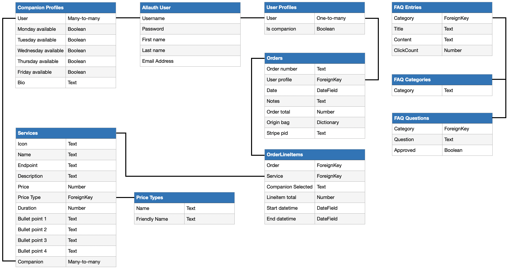
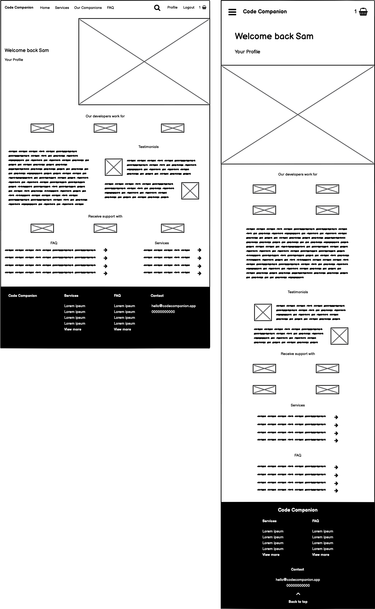
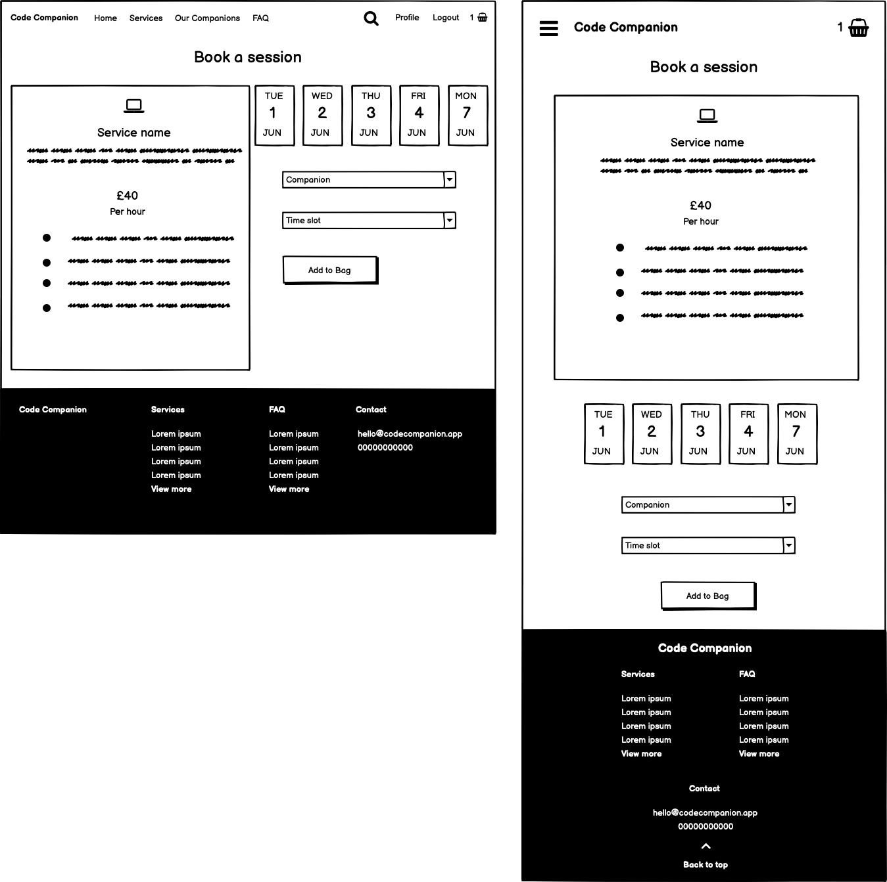

# MS4: Code Companion

Full Stack Frameworks with Django Project Submission<br>
[Table of contents](#table-of-contents) below **Guided Tour**

## Access

View the deployed project: [here](https://codecompanionapp.herokuapp.com)

View the Github repo: [here](https://github.com/rbsam176/ms4-codecompanion)

## Guided Tour
There are many different components to Code Institute, and each journey is different depending on what type of user your are. To make things easier, below is a bullet pointed list of things to try in order to explore every aspect of Code Companion. I have also included login details for user accounts with different permissions, and some example data that you can input to test the CRUD functionality.

### Regular User/Student account journey
**Username:** rrthais<br>
**Email:** rr.thais@gmail.com<br>
**Password:** xXwQKxj8A3XBt3xk <br>
**Type:** Regular User/Student account

* Sign up for an account or login using the account details above
* Go to the 'Compare Services' page
* Read through the Services and select one by clicking 'Book a session'
* Select an available date
* Select an available Companion
* Notice that some time slots ma be unavailable if the Companion already has a session booked for that time
* Select an available time slot
* Click 'Add to Bag'
* Click the bag icon in the top right corner
* Click 'Complete Order'
* Add notes relating to your order. For example a student might write what they hope to achieve in the upcoming session
* Enter card details, these can be found [here](https://stripe.com/docs/testing#cards), or by entering 4242 4242 4242 4242, any future expiry date and any CVC
* Click 'Complete Order' and verify you have reached the Order Confirmation page
* Go back to the Service page and notice that the time slot you just booked is now unavailable to book
* Click 'Profile' in the top right corner
* Verify within the 'Upcoming sessions' section that your session is listed
* Verify within the 'Order History' section that your order is listed
* Click the order number to go to the View Order page
* Observe the full order details and current status of the order
* Go back to the Profile page and wait until 3 minutes before your session start time
* Observe that the Upcoming Sessions section of the Profile page now has a link to Join Session
* This Join Session link will also be displayed on the View Order page
* Clicking Join Session takes you to a page that has a Jitsi web conferencing room embedded, with your username pre-populated
* Click on search inside navigation
* Search for companion username, eg. 'rbsam'
* Click on the search result showing a Companion with the username 'rbsam'
* Notice on the 'Our Companions' page that the searched companion is highlighted
* Click anywhere outside the searched Companion container and notice the highlight is removed and the url reverts back to the normal '/companions' endpoint without the search query
* Go to the FAQ page
* Click the question to collapse the answer. Doing this multiple times on the same question will result in that question being one of the top 4 listed on the homepage, as it is determined based on number of clicks
* Click 'Still have questions'
* Submit a new question to the FAQ
* Login as superuser/admin to approve this question from 'Admin Controls' withn profile page

### Companion
**Username:** bakerml<br>
**Email:** bakerml@mac.com<br>
**Password:** xXwQKxj8A3XBt3xk<br>
**Type:** Companion account

* Can book a session as a student as well
* Can have regular Users book a session with you and it appear in 'Upcoming Sessions (as Companion)
* Can submit FAQ questions for approval

### Admin/superuser
**Username:** sambaker<br>
**Email:** rb.sam@icloud.com<br>
**Password:** xXwQKxj8A3XBt3xk<br>
**Type:** Admin/superuser account

* Can add Services
* Can edit Services
* Can delete Services
* Can Edit FAQ questions & answers
* Can approve/deny FAQ entries from users
* Can do everything a Companion or regular User can

#### Example Service input data

If you want to test adding a new Service to Code Companion, feel free to use the values below. You must be logged in as a superuser/admin to see the option to Add Service in the navigation menu.

**FontAwesome icon class**: fas fa-hand-pointer

**Name**: Portfolio Review

**Endpoint**: portfolio-review

**Description**: Get feedback and advice on your portfolio before applying for positions

**Price**: 40

**Price type:** per session (1 hour)

**Duration:** 1

**Bullet point 1:** Refine your portfolio using the advice of a senior Companion to shape your first impression with potential employers.

**Bullet point 2:** Work on how to effectively communicate your development journey and discuss the challenges your faced along the way.


## Table of Contents
* [Strategy](#Strategy)
	* [User Stories & Project Objectives](#user-stories--project-objectives)
* [Scope](#scope)
	* [Current Features](#current-features)
		* [CRUD](#crud)
		* [Features](#features)
	* [Long-term Vision](#long-term-vision)
* [Code Walkthrough & Challenges](#code-walkthrough--challenges)
	* [FAQ on Homepage](#faq-on-homepage-displaying-4-most-popular)
	* [Time slots](#time-slots)
	* [Availability Clash Check](#availability-clash-check)
	* [Time zones](#time-zones)
	* [Jitsi API Integration](#jitsi-api-integration)
	* [Order History Pagination](#order-history-pagination)
* [Database Schema](#database-schema)
* [UX](#ux)
	* [Wireframes](#wireframes)
		* [Homepage](#homepage-1)
		* [Service Detail](#service-detail)
* [Testing](#testing)
* [Deployment](#deployment)
* [Credits & Attributes](#credits--attributes)

## Strategy

### User Stories & Project Objectives

*"As a user..."*

<details>  
<summary>I want to get almost immediate support for a coding problem without having to wait long for a response</summary>
Code Companion allows you to book sessions with experienced developers who can help you through resolving issues with your code. Sessions are available to begin every 30 minutes depending on the availabilty of our companions.
</details><br>

<details>  
<summary>I want to be able to learn from an experienced developer face to face, rather than through message board or StackOverflow responses.</summary>
Every session is available face to face using Jitsi, a web conferencing platform. Screen sharing is supported so you can have the Companion walk you through your issue while you're scrolling through your code.
</details><br>

<details>  
<summary>I want to be able to have a one-off sessions on preparing for employment without having to do a full coding bootcamp.</summary>
Every session is purchased individually without the need to bulk-buy or subscribe. You can purchase a session on Interview Preparation, or a Code Review if you find yourself at the stage where you're ready to apply for positions.
</details><br>

## Scope

### Current Features

#### CRUD

- #### Create

  - Visitors to Code Companion can signup and create an account.
  - Users can select a service, date, Companion, and time to purchase. 
  - Users ask new questions to be added to the FAQ.
  - Users can convert their account to be a Companion profile, allowing them to take sessions and earn money.
  - Users can add notes to their order for the Companion to see
  - Companions can set which days of the week they are available.
  - Companions can set what services they are able to offer.
  - Superusers/Admin users can add a new Service
  - Superusers/Admin users can review questions submitted by users to the FAQ and choose to approve or delete
  - Superusers/Admin users can add new questions to the FAQ

- #### Read

  - Users can view all services and sort them by most popular (based on number of orders) or price low>high / high/low
  - Users can see their order history from their profile
  - Users can see their upcoming sessions from their profile
  - Users on the homepage can see the top 4 most read FAQ entries based on number of clicks.
  - Users can run a search command and receive search results matching Services or Companions
  - When viewing the profile page, if the user has more than 3 orders then a 'Show more' button is displayed which will read the next 3 oldest orders and append them to the table.
  - Companions can see their upcoming sessions they need to teach from their profile
  - Companions can see notes written by users for upcoming sessions
  - Superusers/Admin users can see questions submitted by users pending approval

- #### Update

  - All users can change their email-address and password from their profile
  - First name and Last name must be entered to convert account to be a Companion profile
  - Companions can update their availability or sessions offered from their profile
  - Companions can convert their profile back to being a regular user
  - Superusers/Admin users can edit questions submitted by users for approval and respond with answers
  - Superusers/Admin users can edit existing services
  - Superusers/Admin users can edit existing FAQ entries

- #### Delete

  - Superusers/Admin users can delete existing FAQ entries
  - Superusers/Admin users can delete user submitted FAQ entries pending approval
  - Superusers/Admin users can delete services

#### Features

- #### Base template

  - Dropdown menu showing all Services and a link to Compare Services so they can all be seen on one page.
  - Collapsible search menu on desktop
  - Basket button with live counter of number of sessions in bag
  - Responsive footer which changes structure depending on breakpoint. Easy access to links to various Services and FAQ questions.

- #### Homepage

  - The hero container changes its content depending on whether user is logged in or not. Default view is a hero banner inviting users to sign up for an account. Entering the email will take the user to the Sign Up page with their typed-in email already populated. The logged-in view provides a button that links the user to their profile page where they can quickly view upcoming orders.
  - 'Interested in becoming a Companion?' link to modal on hero banner, informing users that they can sign up for an account and then convert it to be a Companion profile. Bullet points with benefits of becoming a Companion.
  - Lineup of companies that Companions have experience working for, to give users an impression of the backgrounds and experience that can be shared if they sign up for a session.
  - Testimonials from previous students, to offer perspectives to further entice prospective students.
  - Lineup of web technologies that our Companions have experience using. This offers some background on what sort of support can be offered before the user visits the Services page.
  - FAQ preview. This displays 4 frequently asked questions, and the 4 shown are dynamic depending on how many times users have viewed the question on the main FAQ page.
  - Links to every Service offered, plus an additional link to the Compare Services page so the user can see them all on one page.
  - If the user is not logged in, an additional section is at the bottom of the homepage that allows them to enter their email and it be transferred to the Sign Up page with the email already populated.


- #### Services

  - **Service detail**<br>
	- The user selects the date within the next 5 working days (Mon-Fri), the Companion they wish to work with and the time. These values are populated dynamically. 
	- On page load it will check if there is a Companion available on each day, and it will disable any day that has no Companiosn. 
	- Once the date has been selected it will check which Companions are scheduled that day and populate the dropdown accordingly. Selecting a Companion will then populate the times between 9am-6pm. 
	- If the user has selected the same day they're viewing then it will remove any elapsed time slots. 
	- Any time slots where the Companion is already in a session will be disabled. 
	- If all time slots have elapsed, or if all time slots are disabled then a message is displayed informing the user to select a different date. 
	- If the user is not logged in then the Add To Bag button is not displayed and a link to login is. 
	- If the user is logged in but hasn't selected a time yet, the Add To Bag button will be disabled.	

  - **Compare Services**<br>
	- All services are displayed in a grid view that is responsive depending on breakpoint.
	- User is able to sort by Most Popular (based on number of orders), or Price Low>High / High>Low
	- Sign up email input is shown to users who aren't logged in, and redirects them to the Sign Up page with the email already populated


- #### Our Companions

  - Lists all Companions signed up on Code Companion, with their full name and username displated. The schedule availability and services offered are indicated with green ticked icons and all containers are resized responsively depending on breakpoint.

- #### FAQ

  - Collapsible view of FAQ questions, revealing the answers when clicked. Every collapse is counted to inform the homepage which 4 FAQ questions have been the most opened.
  - If the user has a question not answered by the FAQ, they have the option to click 'Still have questions?' where they can choose the category that their question relates to and type the question. This will be sent to the superusers/admins who can view all pending questions in a queue and choose to answer and approve them to be displayed in the main FAQ.

- #### Search

  - The users search query is shown to them to verify what they typed was was is being queried.
  - Their search query looks at matches with Service names and Companion usernames and are displayed in their separate fields.

- #### Profile

  - The user is informed what their account username is and a link to logout, incase they are mistakenly logged in as a different user.
  - If a superuser/admin is viewing the profile page, they will see a link to 'Admin controls' which shows the pending FAQ queue.
  - Users can update their email, first name, last name and can convert their account to be a Companion profile.
  - Upcoming sessions are listed with their corresponding status ('upcoming' / 'active'). A session will show that it is active and provide a link to the session room 3 minutes before the session start time.
  - Order History shows order numbers, date of purchase, total spent and the line items of each order. The order number is linked to a page where the user can view full details about the order.
  - 3 orders are displayed by default under Order History, but if more than 3 exists the user will see a 'Show more' button which will read the next oldest 3 orders, it will then append it below.
  - If the user viewing the profile page is a Companion, they will see an additional section showing Upcoming Sessions (as Companion), so they can get access to the session rooms and details of upcoming sessions with students.

- #### View Order

  - Full information about the order is displayed, including the order number, total spent, date ordered and each line item service.
  - Each line item service shows a graphic which indicates what stage the user is at for the service. For example, if the order was just placed, it will be 'Awaiting session'. 3 minutes before the session begins it will switch to 'Session active' and provide a link to the session room. Once the session is over, it will switch to 'Session expired'.
  - Notes that the student typed when they placed the order will also be displayed if there are any.

- #### Active Session

  - 3 minutes before the start time of a session, the link will appear within the Upcoming Sessions section of the profile, and from the View Order page. This link will take the user to a page that has the Jitsi web conferencing system embedded, with their username automatically populated. The Companion will see the same link from their Upcoming Sessions (as Companion) section of thier profile page.

- #### Admin controls

  - The main admin controls page is only accessible tp superusers/admins from a link within the profile page.
  - The page shows any questions users have submitted for approval, with options to delete the question or respond to it and approve.
  - When viewing the FAQ, controls appear for superusers/admins that don't appear to normal users, allowing the FAQ entries to be edited or deleted.
  - From the navigation menu, the option to Add Service appears, along with Edit Service and Delete Service on the service detail pages.

- #### Bag

  - The bag page displays any services the user has added to the bag, displaying the service name, Companion name, start date and time, price and length of session along with the option to delete. 
  - The total cost is displayed and if items are in the bag the Complete Order button is displayed. If no items are in the bag, a link to Compare Services is displayed instead.

- #### Checkout

  - The checkout page has an optional area for the user to enter notes that the Companion can see before their session begins.
  - The Stripe card element is embedded, which prompts for the users FPAN, expiry and CVC for payment.
  - Line items are displayed, along with the grand total.
  - While the order is being transacted, a full screen modal is displayed to both indicate to users that the transaction is being processed and to prevent users from interupting the process.


### Long-term vision

- Currently the days of the week availability is in static table, I would prefer to make this similar to Services which is a relational table where new services can be added to it through the website without editing the code. Right now, if Code Companion were to start offering sessions on weekends, a lot of code would need to be rewritten.

- Currently, when viewing the service detail page, if the user selects a date it will check which companions are available, once the user selects a companion it will populate the time slots. However, if all of the time slots are expired or clash with existing sessions that the Companion has, it displays a message to the user saying the day is full. Eventually I would prefer if all of this logic happens before page load so that date is disabled from the beginning, saving the user 2 additional clicks.

-  Right now, if a Companion needs 1 particular day off, they need to remove that day from the availabilty entirely. Eventually I would like to build a booking system where the Companion can book their own time off without having to adjust their availabilty.

- If a Companion converts their profile back to being a regular user it will inform all users when they next view their order on their profile to contact Code Companion for a refund. In the future I would like to build in the logic to automatically refund users for these cancelled sessions, and/or give the Companion the option to still carry out these sessions but not to accept any more.

- The Order model Line Items references the Companion with a text field currently. During the development of Code Companion I learned a lot more about database relationships and in a future build I would change this to be a Foreign Key rather than a text field.

- Refine pep8 compliancy and code validation (HTML, CSS). The code is currently scoring highly in accessibility and there are no long lines of Python code that hurt readability, but due to time constraints small inefficiencies like trailing whitespaces have not been removed.

# Code Walkthrough & Challenges

## FAQ on homepage displaying 4 most popular

The FaqEntry model has a 'clickCount' decimal field which is written to every time a user collapses the FAQ question to read the answer. This is done by tracking the users click using JavaScript, which sends an AJAX signal to '/faq/counter'. Within the views.py of the FAQ app there is some logic which receives the signal that a user has clicked the question, and it gets the current count from the database, adds 1 and updates the database with the new click count.

The homepage then displays the 4 most read FAQ entries (and a link to view all) by having the view send this queryset to the template.

```faq_ordered = FaqEntry.objects.all().order_by('-clickCount').values('clickCount', 'title', 'content')[:4]```

## Time slots

Within the Services app, I have a function that generates the default time slots displayed when a user goes to make a booking. The opening hour and closing hour of Code Companion are inputted, which in our case is 9am-6pm, and then a list of Python datetime objects are appended with 30 minute gaps between start times. This takes into account the duration of each session, as some are 1 hour long, some are 1 hour 30 minutes long. It also takes into account when a session will overlap the closing time of Code Companion and knows not to append it if thats the case.

## Availability clash check

Also within the Services app is a function which receives the companion that the user selected, along with the date selected and then returns time slots that they are available, taking into account any pre-existing sessions they have booked with other students.

The logic behind this is to loop through all future sessions assigned to that Companion and then loop through the default time slots and check the following:
* Is the start time of the time slot later than the existing order end time? Or is the end time of the time slot earlier than the existing order start time?<br> **If so, do nothing, there is no clash so keep this time slot in the list.**
* Is the end time of the time slot the same as the existing order start time and the time slot start time is less or equal to the existing order end time?<br> **If so, check the folllowing:**
	* Is the end time of the time slot less or equal to the existing order start time? Or is the start time of the time slot more or equal to the existing order end time?<br> **If so, do nothing, there is no clash so keep this itme slot in the list.**
	* If the above is not true, there is a clash, add this status to the item in the list so the template knows to disable this time slot.
* Is the start time of the time slot the same as the existing order end time?<br> **If so, check the following:**
	* Is the start time of the time slot more or equal to the existing order end time?<br> **If so, do nothing, there is no clash so keep this time slot in the list.**
	* If the above is not true, there is a clash, add this status to the item in the list so the template knows to disable this time slot.
* For all other scenarios, there is a clash, add this status to the item in the list so the template knows to disable this time slot.

## Time zones

The biggest challenge when working on Code Companion was getting to grips with how time zones work in Django. Time data is passed both ways between the backend and frontend, which makes it difficult to keep track of what time zone belongs to what datetime object. All backend datetime objects have a UTC timezone. Within settings.py the TIME_ZONE is set to be 'Europe/London'. This means any datetime objects passed to templates are automatically converted to London-time for the user to view. However because the times the user has selected when placing an order are sent back to Django, these must be converted back into UTC as they are being parsed as strings, not as datetime objects. This took a lot of getting used to, and could likely be simplified in a future build.

## Jitsi API integration

To enable the session room functionality for both the student and the Companion, I used Jitsi's API. This asks for a room name, which should be unique as it generates the room url, and you can optionally pass in the users display name. For the room name I passed in 'CodeCompanion-' followed by the order number, as this is a unique code linked to each order made by the user. Because the booking system prevents the user from booking 2 sessions at the same time, a scenario where the same room used for 2 sessions would be avoided. The display name is the logged-in users username, which is automatically populated when the user visits the page.

## Order History pagination

I've used Django's built-in Pagination engine, but modified it to not spread over multiple pages but instead append vertically without the page having to reload or change endpoint. 3 orders are passed to the profile template by default, and it checks if more than 3 exists which determines if a 'Show more' button appears. If the user clicks the 'Show more' button it sends an AJAX signal to return 3 additional orders and checks again if there are more than the new batch of orders. Once it determines that after the next 'Show more' request there aren't any more orders, it will disable the 'Show more' button.

# Database Schema




# UX

## Wireframes

### Homepage


### Service detail


# Testing

Before starting to write code for Code Companion, I loosely practiced Test Driven Development by writing test cases in advance of writing the code. This allowed me to develop the project with a structure already in place, with pre-written test cases that I could verify were passing before proceeding to the next stage.

[Click here to view the test cases.](bugtests.md)

# Deployment

Code Companion uses Git version control, with the code stored on GitHub that automatically deploys to Heroku. AWS has been integrated for connection to a postgres database and storage of media asses such as images, and is automatically deployed to the S3 bucket on every Git push. 

For local testing, a .env file was created and added to the .gitignore file which contains the SECRET_KEYS used for Django and Stripe. To test Stripe integration locally, ngrok was used to allow my locally hosted server to be a subdomain of ngrok so that a secure connection could be made to Stripe.

For deployment, config variables were added to Heroku such as AWS, Django's postgres database url, Google Mail integration for sign up and confirmation emails, Stripe and a boolean to indicate whether AWS is in use.

A Python module called 'Python-DeCouple' was used to access local environment variables. I have used if statements within settings.py to determine if Django has access to the DATABASE_URL environment variable from Heorku and if it doesn't then it uses the local sqlite database configuration. Wrapped up in this conditional also determines the email configuration, based on whether the database is connected. I decided to implement it this way rather than having the email configuration be in its own conditional as the database type should always indicate whether the app is in its deployed state or local state, so it is sufficient for determining the email configuration as well. This could be split out in a future build if there was a scenario where I wanted different email configuration when deployed to the Postgres database.


# Credits & Attributes

[Real Favicon Generator](https://realfavicongenerator.net/): for easy image resizing for various favicons.

[ngrok](https://ngrok.com): for testing Stripe integration using my local server.

[FontAwesome](https://fontawesome.com): for all icons used throughout Code Companion.

[Storyset](https://storyset.com/illustration/telecommuting/amico): for usage of their illustration for the homepage hero container.

Credit to [this Stackoverflow post](https://stackoverflow.com/questions/2519923/get-rid-of-spaces-between-spans/11430717#11430717) for guidance on how to remove whitespace betweens spans.

Credit to [this article](https://css-tricks.com/gradient-borders-in-css/) for guidance on how to have a gradient border.

Credit to [this Stackoverflow post](https://stackoverflow.com/questions/21298035/how-to-get-localetime-without-seconds-in-javascript) for guidance on how to use JavaScript and regex to strip time from a datetime object.

Credit to [this Stackoverflow post](https://stackoverflow.com/questions/10732690/offsetting-an-html-anchor-to-adjust-for-fixed-header) for guidance on how to offset scroll anchors to compensation for the height of the navigation bar.

Credit to [this article](https://www.tutorialspoint.com/how-to-remove-the-hash-from-window-location-url-with-javascript-without-page-refresh) for guidance on how to remove the hash from a url without refreshing the page.

Credit to [this Stackoverflow post](https://stackoverflow.com/questions/4668619/how-do-i-filter-query-objects-by-date-range-in-django) for guidance on how to form a Django query to check if a datetime object is greater than another datetime object.

Credit to [this Stackoverflow post](https://stackoverflow.com/questions/34902707/how-can-i-pass-data-to-django-layouts-like-base-html-without-having-to-provi) for guidance on how to pass a variable to the base template.

Credit to [this article](https://realpython.com/django-redirects/) for guidance on how to have the /services endpoint redirect to /services/compare-services

Credit to [this Stackoverflow post](https://stackoverflow.com/questions/9122169/calling-filter-with-a-variable-for-field-name/9122180#9122180) for guidance on how to pass a variable as the key in a Django query.

Credit to [this Stackoverflow post](https://stackoverflow.com/questions/2883461/django-query-spanning-multiple-many-to-many-relationships) for guidance on how to query a field in a many-to-many relationship table.

Credit to [this article](https://simpleisbetterthancomplex.com/tutorial/2016/08/29/how-to-work-with-ajax-request-with-django.html) for guidance on how to use AJAX to communicate with a Django function